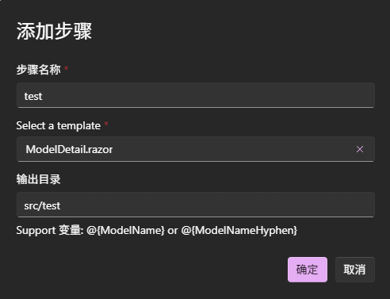
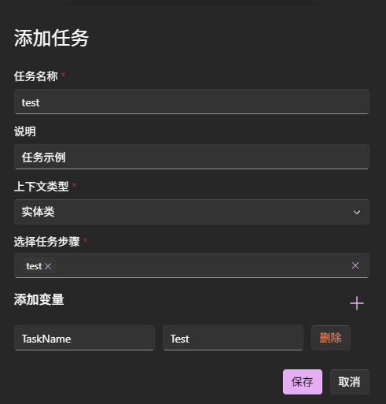

# 自定义生成任务

工具提供了自定义代码生成任务的功能，允许用户根据特定需求生成代码。本篇介绍如何创建和使用自定义代码生成任务。

代码生成相关功能在导航`代码生成/生成任务`下。

## 创建自定义生成任务

创建生成任务分两步：
1. 创建步骤
2. 创建任务

一个任务可包含多个步骤，每个步骤会有对应的模板和生成路径。

假设我们已对有一个示例模板，如果没有请参考[代码模板](../数据管理/代码模板.md)创建一个。

### 创建步骤

点击步骤列表右侧的 + 按钮，进入创建步骤页面：

- 你只能选择一个模板文件
- 你可以在输出目录中使用支持的变量。
  

### 创建任务

点击任务列表右侧的 + 按钮，进入创建任务页面：

上下文类型用于指定代码生成时所使用的数据类型，包括:

1. 实体(Entity)，常用在根据实体生成dto，或生成Sql脚本，或进行转换等。
2. DTO模型(DTO Model)，如生成请求模型，响应模型，以及前端页面等。
3. OpenAPI，用于
4. 你可以添加自定义变量，以便在模板中使用。
5. 