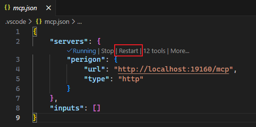

# Custom MCP Tools

Perigon has some built-in MCP tools, mainly used to generate Asp.Net Core code structure.

In actual development, we may need more tools, so we meet the needs through custom MCP tools.

## Adding Custom Tools

Before adding custom tools, we need to first add [templates](../Data-Management/Code-Templates.md) and [prompts](../Data-Management/Prompts.md). Then add custom tools in the `MCP` page.

A tool can only select one prompt, but can select multiple templates.

- Prompt: Used to tell the tool how to generate code.
- Template: Used to provide code structure or reference.

Custom tools generate final code based on prompts and templates.

When adding a custom MCP tool, we will see:

- Name: Name that conforms to mcp specifications, i.e., lowercase with underscores, such as `create_service`.
- Description: Very important, used to describe the function of the tool. Describe accurately so that it can be called correctly.

## Using Custom Tools

After adding custom tools, we need to retrieve the tool list again in the client to see the newly added tools. Please open the `mcp.json` file and click `Restart`.

View the tool list, custom tools will appear in the list. Now you can use the tool in the IDE.

