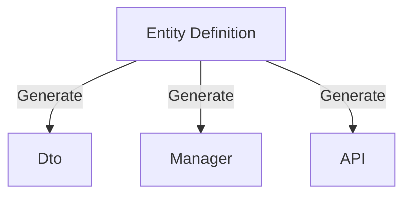
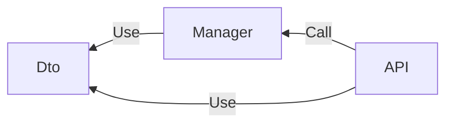

# Introduction

This guide introduces the features, value propositions, and technology stack of Perigon.CLI, helping developers quickly evaluate its suitability and make informed decisions.

## What is Perigon.CLI?

In terms of naming, DRY stands for "Don't Repeat Yourself," and Copilot means "co-pilot," symbolizing its role as a developer assistant that helps reduce repetitive work and improve development efficiency.

From a technical implementation perspective, it is a tool built on the .NET ecosystem, distributed through the NuGet package manager.

In terms of features, it provides the following core capabilities:

- **Solution Templates**: Provides well-designed, clearly structured, and highly versatile Web API templates with core dependencies including:
  - ASP.NET Core
  - Entity Framework Core
  - .NET Aspire
- **Command-Line Tools**: Supports one-click launch of Web UI, MCP Server, and code generation commands.
- **Dashboard**: Integrated UI panel covering the entire workflow from solution creation to code generation and configuration.
- **MCP Server**: Facilitates IDE integration, leveraging Large Language Models (LLM) for precise code generation.

In short, Perigon.CLI is based on solution templates and empowers developers to efficiently complete business development tasks through automated code generation.

## Purpose and Benefits of Perigon.CLI

The core value of Perigon.CLI lies in addressing common pain points in software development and improving overall development efficiency:

- **Infrastructure Setup**: Avoids spending significant time configuring basic environments for each project from scratch.
- **Repetitive Business Implementation**: Automates common business logic such as CRUD operations, reducing tedious repetitive work.
- **Frontend-Backend Integration**: Reduces communication costs and ensures consistency through standardized API definitions.
- **Code Standards and Maintenance**: Provides standardized code structures, avoiding codebase bloat and maintenance difficulties.

Building on this foundation, the tool also supports custom code generation and integrates MCP Server, enabling natural language-driven code generation within IDEs.

Its fundamental purpose is to provide a foundational framework and toolset to help developers quickly build backend services and frontend applications. Main objectives include:

- **Enhance Developer Experience**: Optimize individual development workflows.
- **Accelerate Development Speed**: Improve delivery efficiency for enterprise-level projects.
- **Write Maintainable Code**: Ensure code quality and long-term scalability.

The ultimate result is: developers work more efficiently, coding becomes more enjoyable, business requirements are rapidly implemented, and development costs and risks are significantly reduced.

## Do You Need Perigon.CLI?

While Perigon.CLI is committed to using mainstream and universal technologies to solve most development scenarios, it cannot meet everyone's needs or preferences.

If your project meets any of the following conditions, Perigon.CLI may not be suitable:

- Must use Minimal API or AOT (Ahead-of-Time) compilation.
- Cannot accept Entity Framework Core as the ORM.
- Requires adherence to specific design patterns (such as TDD, DDD, CQRS).
- Does not support Code First development approach.
- Cannot accept GUID as the primary key type.
- Cannot upgrade to .NET 10 or higher.
- Requires use of domestic Chinese databases.

Specific explanations:

- By default, uses Controller to define API endpoints, and code generation is based on this; MVC currently does not support AOT.
- Prioritizes Entity Framework Core as the ORM and recommends Code First approach for defining database models.
- Code generation aims to simplify workflows, not enforce specific design patterns (but does not restrict their use).
- EF Core, .NET Aspire, and code generation all embody the Code First philosophy.
- Uses GUID (V7) as the default primary key, as it performs well in most scenarios and avoids unnecessary controversies.
- .NET 10 is the minimum supported version and the recommended version for new projects.

In summary, adopting the default template structure and technology stack maximizes the use of built-in code generation features and improves development efficiency.

> [!NOTE]
> The project template is essentially an ASP.NET Core Web API project and does not restrict any libraries or development approaches. To avoid complexity, we choose universal and efficient solutions and provide default code generation options.

> [!IMPORTANT]
> Custom code generation can be implemented based on other ORMs or design patterns, completely bypassing built-in features, but you must configure them yourself and assume the associated technical risks. Please refer to the [Advanced Topics] documentation.

## Key Features

The core characteristics of Perigon.CLI lie in its universality and flexibility, specifically manifested as follows:

- **No Additional Mental Burden**: Does not introduce new design patterns or theories, avoiding increased learning and comprehension costs.
- **Based on Mature Technology Stack**: Completely relies on ASP.NET Core and Entity Framework Core, helping developers deeply understand and effectively utilize these technologies.
- **Customizable Code Generation**: Built-in generation features provide a fast path to business implementation, while supporting custom templates to meet personalized needs.

### Core Dependencies

- ASP.NET Core: Build RESTful-style API services based on WebAPI.
- Entity Framework Core: Default ORM, Code First approach.
- Aspire: Simplify development environment configuration and management, multi-service support across languages, from development to deployment, Code First approach.

### Required Dependencies

Refers to third-party libraries included in the template by default:

- Swashbuckle.AspNetCore.SwaggerGen: Stable and feature-rich OpenAPI specification generation tool.
- Mapster: High-performance, lightweight, and zero-configuration object mapping library.
- EFCore.BulkExtensions: Supplements Entity Framework Core's shortcomings, providing efficient bulk operation support.

### Optional Components

Refers to runtime components integrated through Aspire, not included in the template by default, provided through ToolKit.

- Nats: Lightweight, high-performance message queue client supporting publish/subscribe and request/response patterns.
- Redis: High-performance distributed caching client supporting multiple data structures and advanced features.
- Qdrant: Vector database client supporting efficient storage and retrieval of vector data.

## Core Philosophy

In object-oriented programming, we model real or abstract things through classes and interfaces, defining things and their relationships. Whether it's business logic, data access, backend services, or frontend applications, all revolve around these things.

### Entity-Centric Business Model

Entity definition is the central starting point of development, gradually extending to all levels of code from entity definition.

The code generation feature uses Roslyn to analyze entities and automatically generates DTO definitions, database queries, API services, and other code.

In frontend-backend interaction and service communication, the OpenAPI specification describes APIs and supports generating multi-language client code.

This ensures that names, comments, and attributes defined in entities run through the entire generation process, maintaining consistency and reducing errors.

### Code-Centric Development

In actual development, in addition to writing code, there are also tasks such as environment setup, configuration and debugging, testing, documentation writing, and client integration, all of which consume significant effort.

We advocate returning to the essence of code, focusing on business logic implementation and reducing peripheral work. Therefore, we recommend:

- Using Entity Framework Core to simplify database operations, using Code First to define models, and avoiding manual SQL writing.
- Leveraging .NET Aspire to simplify service configuration and management, supporting containerized operation.
- Project templates encapsulate common service configurations such as caching, databases, and message queues, ready to use out of the box.
- Automating template code writing and maintenance through code generation and custom templates.

### Simplified Development Model

Backend development can be summarized into the following steps:

- **Definition**: Entity and DTO definitions.
- **Implementation**: Business logic implementation (Manager), covering databases, caching, message queues, third-party services, etc.
- **API**: Define RESTful APIs, ensuring consistency through tools like OpenAPI.

Relationship diagram:

DTO/Manager/Controller relationship:

Code generation can generate all of the above with one click, implementing basic CRUD functionality and providing usable APIs. Developers can extend on this foundation.

### Results-Oriented

We avoid excessive discussion of design patterns or development theories. Development should be oriented towards customer needs and business results, not patterns themselves.

The key is whether customer needs can be quickly met and business goals achieved.

It must be emphasized that rapid development does not equal low-quality code. On the contrary, low-quality code reduces efficiency and quality. Rapid means building on a good architecture foundation, using tools to generate standardized code, focusing on business logic, and avoiding pattern controversies.
