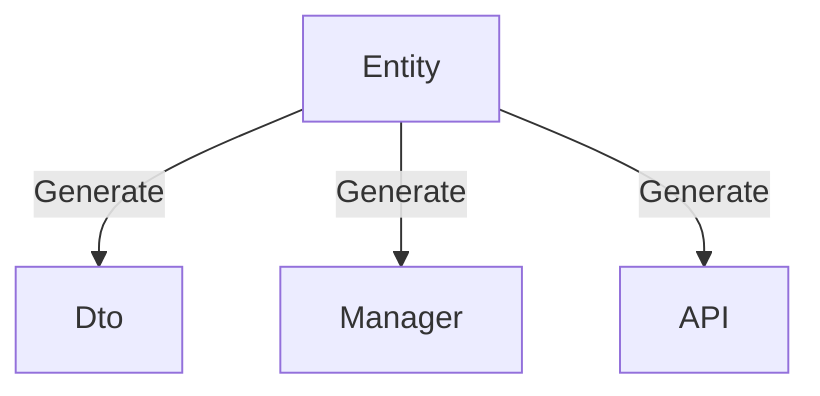
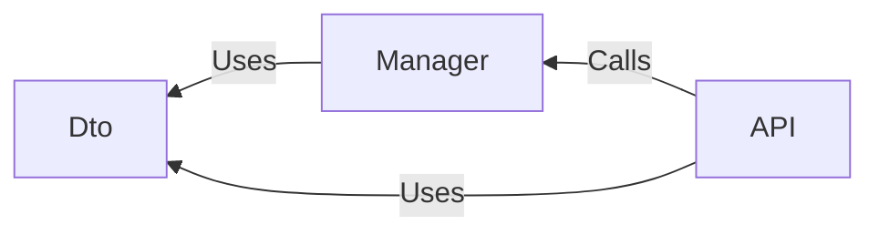

# Getting Started

This guide introduces Perigon.CLI, its capabilities, value, and technology choices so you can quickly judge whether it fits your needs and make an informed decision.

## What is Perigon.CLI?

`Perigon` is a streamlined form of "peregrine," referring to the peregrine falcon—a remarkably swift bird of prey that symbolizes efficiency and agility. Additionally, the word "Perigon" itself carries the meaning of "panorama," reflecting the tool's commitment to delivering comprehensive development support and empowering developers to build applications efficiently.

Perigon.CLI is a .NET-based tool distributed through NuGet. It offers four core capabilities:

- **Solution templates**: well-designed, clearly layered, widely applicable Web API templates built on:
  - ASP.NET Core
  - Entity Framework Core
  - .NET Aspire
- **Command-line tools**: one-click launch for the Web UI, MCP Server, and code generation commands.
- **Dashboard**: an integrated UI that spans the full flow from solution creation to code generation and configuration.
- **MCP Server**: easy IDE integration that uses LLMs for accurate code generation.

In short, Perigon.CLI builds on solution templates and automates code generation to help you deliver business features efficiently.

## Purpose and Benefits

Perigon.CLI targets common pain points to raise overall development efficiency:

- **Infrastructure setup**: avoid rebuilding basic environments from scratch for every project.
- **Repetitive business logic**: automate common tasks such as CRUD to remove tedious work.
- **Frontend-backend alignment**: standardize APIs to cut communication costs and keep interfaces consistent.
- **Code standards and maintenance**: provide a structured codebase to prevent bloat and simplify long-term maintenance.

It also supports custom code generation and integrates an MCP Server so you can drive generation with natural language inside your IDE.

The overarching goal is to supply a solid framework and toolset for quickly building backend services and frontend applications:

- **Improve developer experience**: streamline personal workflows.
- **Accelerate development speed**: increase delivery efficiency for enterprise projects.
- **Write maintainable code**: protect quality and scalability over time.

The result is faster delivery, a better coding experience, rapid implementation of business needs, and lower development cost and risk.

## Is Perigon.CLI Right for You?

Perigon.CLI focuses on mainstream, general-purpose scenarios, but it may not fit if you require:

- Minimal API or AOT (Ahead-of-Time) compilation only.
- An ORM other than Entity Framework Core.
- Strict enforcement of specific design patterns (TDD, DDD, CQRS) via generation.
- Database-first only (the default is Code First).
- A primary key type other than GUID (default is GUID v7).
- Staying on versions earlier than .NET 10.
- Mandatory use of a database without reliable EF Core support.

Details:

- APIs default to MVC Controllers, which drive the built-in generators; MVC Web API currently does not support AOT.
- EF Core is the default ORM and Code First is recommended for defining models.
- Code generation simplifies workflow but does not force patterns; you can still adopt them as needed.
- EF Core, .NET Aspire, and generation all align with Code First.
- GUID v7 is the default key type because it performs well across most scenarios.
- .NET 10 is the minimum supported and recommended version.

Using the default template and tech stack lets you fully leverage built-in generation and maximize efficiency.

> [!NOTE]
> The project template is an ASP.NET Core Web API. It does not restrict any libraries or development approaches. To reduce complexity, we choose effective defaults and provide generation options out of the box.

> [!IMPORTANT]
> You can build custom generators for other ORMs or patterns and bypass the built-ins, but you must configure them and own the associated trade-offs. See Advanced topics.

## Key Features

Perigon.CLI is both general-purpose and flexible:

- **No extra cognitive load**: no new design theories; just practical, proven defaults.
- **Built on mature tech**: fully leverages ASP.NET Core and Entity Framework Core.
- **Customizable generation**: built-ins for speed, plus support for custom templates.

### Core Dependencies

- ASP.NET Core: builds RESTful Web API services.
- Entity Framework Core: default ORM using Code First.
- Aspire: streamlines environment configuration and management; multi-service support from development through deployment; Code First mindset.

### Required Dependencies

Included by default in the template:

- Swashbuckle.AspNetCore.SwaggerGen: stable, feature-rich OpenAPI generation.
- Mapster: lightweight, high-performance, zero-configuration object mapper.
- EFCore.BulkExtensions: efficient batch operations that complement EF Core.

### Optional Components

Runtime components integrated via Aspire Tooling; not included in the template by default:

- NATS: lightweight, high-performance messaging client supporting pub/sub and request/response.
- Redis: high-performance distributed cache client with rich data structures.
- Qdrant: vector database client for efficient vector storage and retrieval.

## Core Principles

In object-oriented design, classes and interfaces model real or abstract entities and their relationships. Whether you are handling business logic, data access, backend services, or frontend apps, everything revolves around these entities.

### Entity-Centric Business

Entity definitions are the starting point. Code generation uses Roslyn to analyze entities and automatically produce DTOs, database queries, and API services. OpenAPI describes the interfaces for frontend/backend interaction and enables multi-language client generation. Names, comments, and attributes defined on entities flow through the generation pipeline to keep everything consistent and accurate.

### Code-Centric Development

Beyond coding, environment setup, configuration, debugging, testing, documentation, and client integration consume significant effort. We encourage focusing on code and business logic while reducing peripheral work:

- Use EF Core to simplify data access; define models with Code First and avoid hand-written SQL.
- Use .NET Aspire to simplify service configuration and management, with container-friendly support.
- Templates bundle common service configuration (cache, database, messaging) for quick starts.
- Automate boilerplate via built-in and custom generators.

### Simplified Development Model

- **Define**: entities and DTOs.
- **Implement**: business logic in Managers, including database, cache, messaging, and third-party services.
- **API**: define RESTful endpoints; use OpenAPI to ensure consistency and enable client generation.

DTO/Manager/Controller relationship:

One command can generate CRUD-ready code and usable APIs; you can extend from there.

### Outcome-Oriented

We avoid debates over patterns for their own sake. Development should serve customer needs and business outcomes.

Fast does not mean low quality. Poor code slows you down. Speed comes from solid architecture plus tools that generate clean, conventional code so you can focus on business logic and skip unproductive disputes.
