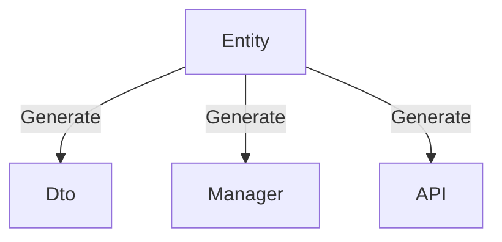
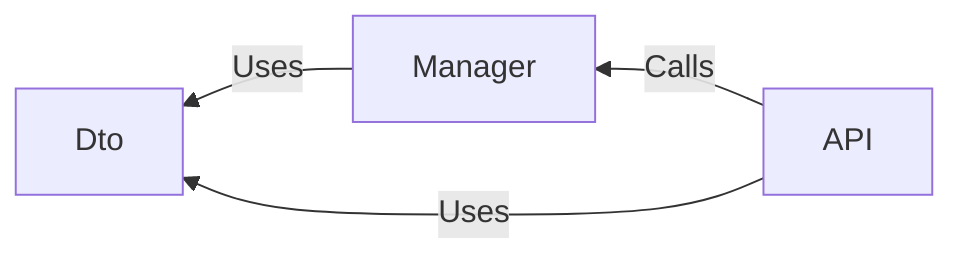

# Introduction

This guide introduces the features, value propositions, and technology stack of Perigon.CLI, helping developers quickly evaluate its suitability and make informed decisions.

## What is Perigon.CLI?

In terms of naming, DRY stands for "Don't Repeat Yourself," and Copilot means "co-pilot," symbolizing its role as a developer assistant that helps reduce repetitive work and improve development efficiency.

From a technical implementation perspective, it is a tool built on the .NET ecosystem, distributed through the NuGet package manager.

In terms of features, it provides the following core capabilities:

- **Solution Templates**: Provides well-designed, clearly structured, and highly versatile Web API templates with core dependencies including:
  - ASP.NET Core
  - Entity Framework Core
  - .NET Aspire
- **Command-Line Tools**: Supports one-click launch of Web UI, MCP Server, and code generation commands.
- **Dashboard**: Integrated UI panel covering the entire workflow from solution creation to code generation and configuration.
- **MCP Server**: Facilitates IDE integration, leveraging Large Language Models (LLM) for precise code generation.

In short, Perigon.CLI is based on solution templates and empowers developers to efficiently complete business development tasks through automated code generation.

## Purpose and Benefits of Perigon.CLI

The core value of Perigon.CLI lies in addressing common pain points in software development and improving overall development efficiency:

- **Infrastructure Setup**: Avoids spending significant time configuring basic environments for each project from scratch.
- **Repetitive Business Implementation**: Automates common business logic such as CRUD operations, reducing tedious repetitive work.
- **Frontend-Backend Integration**: Reduces communication costs and ensures consistency through standardized API definitions.
- **Code Standards and Maintenance**: Provides standardized code structures, avoiding codebase bloat and maintenance difficulties.

Building on this foundation, the tool also supports custom code generation and integrates MCP Server, enabling natural language-driven code generation within IDEs.

Its fundamental purpose is to provide a foundational framework and toolset to help developers quickly build backend services and frontend applications. Main objectives include:

- **Enhance Developer Experience**: Optimize individual development workflows.
- **Accelerate Development Speed**: Improve delivery efficiency for enterprise-level projects.
- **Write Maintainable Code**: Ensure code quality and long-term scalability.

The ultimate result is: developers work more efficiently, coding becomes more enjoyable, business requirements are rapidly implemented, and development costs and risks are significantly reduced.

# Introduction

This document introduces Perigon.CLI’s capabilities, value, and technical stack so you can quickly evaluate its fit and make an informed decision.

## What is Perigon.CLI?

By name, DRY stands for “Don’t Repeat Yourself,” and Copilot implies a helper that reduces repetition and boosts efficiency. Technically, Perigon.CLI is a .NET-based tool distributed via NuGet. Functionally, it provides:

- Solution templates: well-designed, layered, and broadly applicable Web API templates built on:
  - ASP.NET Core
  - Entity Framework Core
  - .NET Aspire
- Command-line tooling: one-click launch for the Web UI, MCP Server, and code generation commands.
- Dashboard: a unified UI that covers the full flow from solution creation through code generation and configuration.
- MCP Server: easy IDE integration that leverages LLMs for accurate code generation.

In short, Perigon.CLI builds on solid solution templates and automates code generation to help you implement business features efficiently.

## Goals and Value

Perigon.CLI focuses on common pain points to improve overall development efficiency:

- Infrastructure setup: avoid re-creating environments for every project.
- Repetitive business logic: automate common tasks like CRUD to remove tedium.
- Frontend-backend alignment: standardize APIs to reduce communication overhead and ensure consistency.
- Code quality and maintenance: encourage structure to prevent bloat and long-term maintenance issues.

It also supports custom code generation and integrates an MCP Server so you can drive generation via natural language inside your IDE.

Primary objectives:

- Improve developer experience.
- Accelerate enterprise delivery.
- Produce maintainable, extensible codebases.

The result: faster delivery, a more pleasant coding experience, and lower cost and risk.

## Is Perigon.CLI Right for You?

While Perigon.CLI targets mainstream, general-purpose scenarios, it won’t fit every need or preference. It may not be suitable if you require:

- Minimal API or AOT (Ahead-of-Time) compilation only.
- A non–Entity Framework Core ORM.
- Strict enforcement of specific design patterns (TDD, DDD, CQRS) via generation.
- Database-first only (we default to Code First).
- Non-GUID primary keys (we default to GUID v7).
- Remaining on versions older than .NET 10.
- Databases without reliable EF Core providers.

Details:

- APIs default to MVC Controllers, which drive the built-in generators; MVC Web API currently does not support AOT.
- EF Core is the default ORM and Code First is recommended for defining models.
- Code generation aims to simplify workflows, not to enforce specific patterns (you may still adopt them as you wish).
- EF Core, .NET Aspire, and code generation all emphasize Code First.
- GUID v7 is the default key type due to strong overall characteristics.
- .NET 10 is the minimum supported and recommended version.

Using the default template and tech stack lets you fully leverage built-in generation and maximize efficiency.

> Note
> The project template is an ASP.NET Core Web API. It doesn’t restrict libraries or development approaches. To avoid complexity, we choose effective defaults and provide generation options out of the box.

> Important
> You can implement custom code generation for other ORMs or patterns and bypass the built-ins entirely, but you must configure them and own the associated trade-offs. See Advanced topics.

## Key Characteristics

- No extra cognitive load: no new design theories—just proven, practical defaults.
- Built on mature tech: ASP.NET Core and EF Core help you move fast and learn deeply.
- Customizable generation: use built-ins for speed or customize templates as needed.

### Core Dependencies

- ASP.NET Core: RESTful Web API services.
- Entity Framework Core: default ORM with Code First.
- Aspire: simplifies environment setup and management; multi-service support from dev to deployment; Code First mindset.

### Included Packages

- Swashbuckle.AspNetCore.SwaggerGen: stable, comprehensive OpenAPI generation.
- Mapster: lightweight, high-performance, zero-configuration object mapper.
- EFCore.BulkExtensions: efficient batch operations that complement EF Core.

### Optional Components

Integrated via Aspire Tooling; not included by default in templates:

- NATS: lightweight, high-performance messaging (pub/sub and request/response).
- Redis: high-performance distributed cache client.
- Qdrant: vector database for efficient vector storage and retrieval.

## Core Principles

### Entity-Centric Business

Entity definitions are the starting point. Code generation uses Roslyn to analyze entities and generate DTOs, database queries, and API services. OpenAPI describes services for frontend/backend interaction and enables client SDK generation across languages. Names, comments, and attributes defined on entities flow through the generation pipeline for accuracy and consistency.

### Code-Centric Development

Beyond writing code, setup, configuration, debugging, testing, docs, and client integration consume time. We emphasize focusing on code and business logic while reducing peripheral work:

- Use EF Core to simplify data access; define models via Code First and avoid hand-written SQL.
- Use .NET Aspire to simplify service configuration and management, with container support.
- Templates package common service configuration (cache, DB, messaging) for fast starts.
- Automate boilerplate via generation and custom templates.

### Simplified Development Model

- Define: entities and DTOs.
- Implement: business logic in Managers, including DB, cache, messaging, and third-party services.
- API: define RESTful endpoints; use OpenAPI to ensure consistency and enable client generation.

DTO/Manager/Controller relationship:

With one command you can generate CRUD-ready code and working APIs, then extend as needed.

### Outcome-Oriented

We avoid academic debates over patterns. Development should serve customer needs and business outcomes.

Fast doesn’t mean low quality. Poor code slows you down. Speed comes from good architecture plus tools that generate clean, conventional code so you can focus on business logic and avoid unproductive debates.

Code generation can generate all of the above with one click, implementing basic CRUD functionality and providing usable APIs. Developers can extend on this foundation.

### Results-Oriented

We avoid excessive discussion of design patterns or development theories. Development should be oriented towards customer needs and business results, not patterns themselves.

The key is whether customer needs can be quickly met and business goals achieved.

It must be emphasized that rapid development does not equal low-quality code. On the contrary, low-quality code reduces efficiency and quality. Rapid means building on a good architecture foundation, using tools to generate standardized code, focusing on business logic, and avoiding pattern controversies.
