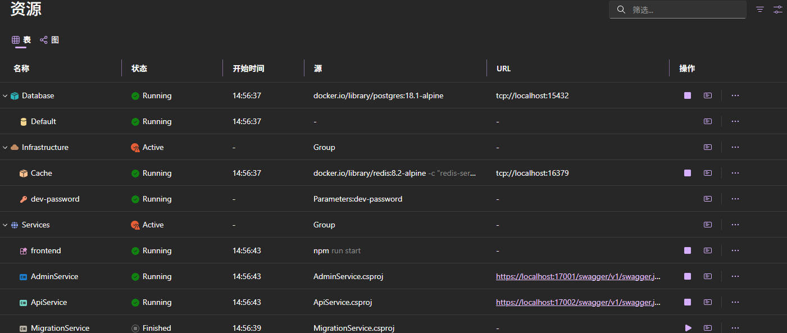

# Quick Start

This guide helps you quickly create and run a project.

## Prerequisites

1. Install `.NET 10` or higher SDK.
2. Install `Docker Desktop` or `Podman`.
3. Install `.NET Aspire 13.0+` components.

For specific requirements, please refer to [.NET Aspire Setup](https://aspire.dev/get-started/prerequisites/).

> [!TIP]
> You can directly install `Visual Studio 2026` and select the `ASP.NET Core` workload, which already integrates `.NET 10 SDK` and `.NET Aspire` components.

## Install the Tool

Use the `dotnet tool` command to install the `Perigon.CLI` tool.

```powershell
dotnet tool install Perigon.CLI --version 10.0.0
```

Please use the latest version available on `nuget.org`.

## Create a Solution

First, open a terminal and execute the following command to launch the management interface in a browser.

```powershell
perigon studio
```

Click the `Create Solution` button to enter the solution creation interface.


After entering the relevant information, click the `Create Solution` button and wait for the creation to complete.

## View the Solution

Open the solution, and in the src directory, you can see the code structure.

Find the `AppHost` project, which will be mainly used to run the project going forward.

The template includes the `SystemMod` module by default, which provides basic user/role/permission management functionality, serving as a reference and code example.

For detailed information about the directory structure, please refer to [Directory Structure](./Project-Templates/Directory-Structure.md).

> [!NOTE]
> If you don't need the default module, it's recommended to delete it through Studio, which will help you correctly remove the module and its related dependencies.

## Run the Project

### Create Database Migration

When running the project for the first time, or after making changes to EF Core entities, you need to create a database migration first.

In the `scripts` directory at the root, call the `EFMigrations.ps1` script to execute the database migration, for example:

```powershell
.\EFMigrations.ps1 Init
```

This script uses the `dotnet ef` command to execute database migrations. The generated migration content will be in the `Definition/EntityFramework/Migrations` directory.


> [!NOTE]
> Please use `PowerShell 7` or higher, which is cross-platform. On Windows, you need to enable the execution policy by running the command `Set-ExecutionPolicy -ExecutionPolicy RemoteSigned -Scope CurrentUser`.

### Start the AppHost Project

Next, let's run the `AppHost` project. You can use VS or the command `dotnet run` to run this project. But before that, you need to ensure `Docker` or `Podman` is already running so that Aspire can pull the necessary images.

Now, take a break ☕, as the first run will download some images and dependencies, which will take some time.

After Aspire is ready, it will automatically open a browser, and you will see the `Dashboard` page, where we can clearly see the running status of infrastructure and services.



For information about the features and usage of the `Dashboard`, please refer to the [Microsoft official documentation](https://learn.microsoft.com/en-us/dotnet/aspire/fundamentals/dashboard).

> [!TIP]
> If you encounter HTTPS or certificate issues during startup, try running the command `dotnet dev-certs https -t` to trust the development certificate.

> [!TIP]
> If you encounter garbled text issues in the .NET Aspire Console, go to the Control Panel regional settings and enable UTF-8 support for global language.

## Understand the Project Template

Through the `Dashboard`, we can intuitively see the dependent infrastructure and service projects. Here's a brief description of each project:

- MigrationService: A service for executing database migrations and initializing data, mainly used during development, which automatically exits after completion.
- ApiService: Provides client-facing API interface services.
- AdminService: Provides interface services needed for backend management, depending on `SystemMod` by default, and initializes admin account and password on first run.
- frontend: Angular frontend project providing a simple backend example.

You can develop your own business logic based on these services, or delete them and create new service projects.

> [!TIP]
> For detailed information about the project template, please refer to [Project Templates](./Project-Templates/Overview.md).

## Test the Project

After the program is running, we can check for any exceptions through the panel and view specific error information through the console. If everything is normal, we can test the API.

### View Swagger Content
If `AdminService` is in the `Running` state, it means it's running normally. Let's first check if `Swagger` is working properly by clicking on the service URL to enter the Swagger page.

### Request API

Find the `AdminService.http` file under `AdminService`. There are two APIs for getting Token and getting user information. Please click them in order and view the returned content.


### Login from Frontend Project

By default, Aspire will start the Angular frontend project. In the Dashboard, you can directly click the link to enter the frontend page and log in using the following information:
- Email: `admin@default.com`
- Password: `Perigon.2026`

### Run Test Project

You can also test the API by running the test project. **Please stop the current Aspire service first**, then find the `ApiTest` project and run it by pressing F5 in VS or executing `dotnet test` in the command line.

The default test project is an integration test project, not a unit test project. When running, it will start an `Aspire` instance, run all services to simulate the actual running environment, and then execute test cases.


You can verify that our services are running normally using any of the above methods.

## Next Steps

1. Understand the project structure and configuration by reading [Project Templates](./Project-Templates/Overview.md).
2. Read [Development Conventions and Standards](./Best-Practices/Development-Conventions.md).
3. Learn to use the code generator for rapid module development by referring to [Using Code Generation](./Tutorials/Using-Code-Generation.md).
