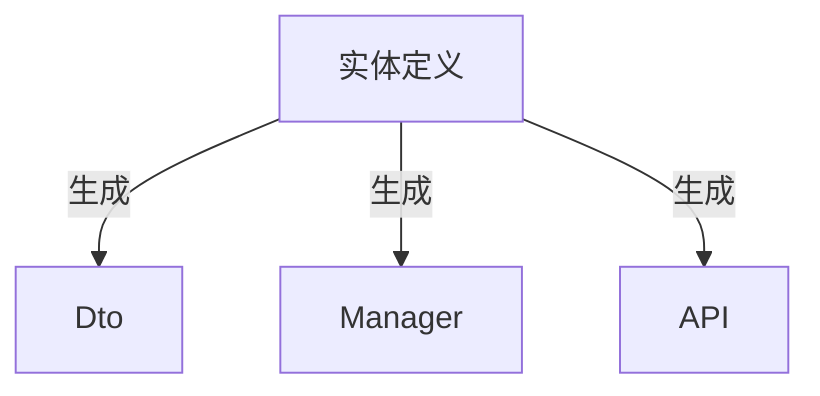
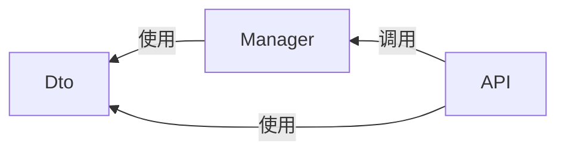

# 入门必读

本篇内容旨在介绍 Perigon.CLI 的功能特性、应用价值和技术选型，帮助开发者快速评估其适用性并做出明智决策。

## Perigon.CLI 是什么？

从名称上而言，DRY 是 "Don't Repeat Yourself" 的缩写，Copilot 意为“副驾驶”，象征其作为开发者助手的作用，帮助减少重复劳动，提升开发效率。

从技术实现角度，它是一个基于 .NET 生态的工具，通过 NuGet 包管理器分发。

从功能特性来看，它提供以下核心能力：

- **解决方案模板**：提供设计优良、层次清晰、通用性强的 Web API 模板，核心依赖包括：
  - ASP.NET Core
  - Entity Framework Core
  - .NET Aspire
- **命令行工具**：支持一键启动 Web UI、MCP Server 以及代码生成命令。
- **Dashboard**：集成式 UI 面板，涵盖从解决方案创建到代码生成及配置的全流程。
- **MCP Server**：便于 IDE 集成，利用大语言模型（LLM）实现精准代码生成。

简而言之，Perigon.CLI 以解决方案模板为基础，通过自动化代码生成，助力开发者高效完成业务开发任务。

## Perigon.CLI 的作用和目的

Perigon.CLI 的核心价值在于解决软件开发中的常见痛点，提升整体开发效率：

- **基础设施搭建**：避免每个项目从零开始耗费大量时间配置基础环境。
- **重复性业务实现**：自动化处理如 CRUD 操作等常见业务逻辑，减少枯燥重复工作。
- **前后端对接**：通过标准化接口定义，减少沟通成本，确保一致性。
- **代码规范与维护**：提供规范的代码结构，避免代码库膨胀和维护困难。

在此基础上，工具还支持自定义代码生成，并集成 MCP Server，实现 IDE 内自然语言驱动的代码生成。

其根本目的是提供一套基础框架和工具集，助力开发者快速构建后端服务和前端应用。主要目标包括：

- **提升开发体验**：优化个人开发工作流程。
- **加速开发速度**：提高企业级项目交付效率。
- **编写易维护代码**：确保代码质量和长期可扩展性。

最终实现的效果是：开发者工作更高效，代码编写更愉悦，业务需求快速落地，显著降低开发成本和风险。

## 你是否需要 Perigon.CLI？

尽管 Perigon.CLI 致力于采用主流通用技术解决多数开发场景，但不能满足所有人的需求或偏好。

如果您的项目符合以下任一条件，Perigon.CLI 可能无法满足需求：

- 必须采用 Minimal API 或 AOT（Ahead-of-Time）编译。
- 不接受 Entity Framework Core 作为 ORM。
- 强制约束实现特定设计模式（如 TDD、DDD、CQRS）。
- 不支持 Code First 开发模式。
- 不接受 GUID 作为主键类型。
- 无法升级至 .NET 10 或更高版本。
- 需要使用国产数据库。

具体说明如下：

- 默认采用 Controller 定义 API 接口，代码生成基于此；MVC 当前不支持 AOT。
- 优先使用 Entity Framework Core 作为 ORM，并推荐 Code First 模式定义数据库模型。
- 代码生成旨在简化流程，而非强制遵循特定设计模式（但不限制使用相关模式）。
- EF Core、.NET Aspire 及代码生成均体现 Code First 理念。
- 默认使用 GUID (V7) 作为主键，因其在多数场景下表现优异，避免不必要的争议。
- .NET 10 为最低支持版本，也是新项目的推荐版本。

综上所述，采用默认模板结构和技术栈，可最大化利用内置代码生成功能，提升开发效率。

> [!NOTE]
> 项目模板本质为 ASP.NET Core Web API 项目，不限制任何库或开发模式。为避免复杂性，我们选择通用高效方案，并提供默认代码生成选项。

> [!IMPORTANT]
> 可通过自定义代码生成实现基于其他 ORM 或设计模式的生成功能，完全绕过内置功能，但需自行配置并承担相关技术风险。请参考[高级主题]相关文档。

## 主要特点

Perigon.CLI 的核心特点在于其通用性和灵活性，具体体现如下：

- **无额外心智负担**：不引入新设计模式或理论，避免增加学习和理解成本。
- **基于成熟技术栈**：完全依托 ASP.NET Core 和 Entity Framework Core，帮助开发者深入理解并有效运用这些技术。
- **可定制代码生成**：内置生成功能提供快速业务实现途径，同时支持自定义模板，满足个性化需求。

### 核心依赖

- ASP.NET Core：基于 WebAPI 构建符合 RESTful 风格的接口服务。
- Entity Framework Core：默认 ORM，Code First 模式。
- Aspire：简化开发环境配置与管理，跨语言的多服务支持，从开发到部署，Code First 模式。

### 必要依赖

指模板默认包含的第三方库：

- Swashbuckle.AspNetCore.SwaggerGen：稳定且功能全面的 OpenAPI 规范生成工具。
- Mapster：高性能轻量化且零配置的对象映射库。
- EFCore.BulkExtensions：补充 Entity Framework Core 的不足，提供高效批量操作支持。

### 可选组件

指运行组件，通过 Aspire 集成，默认不会包含在模板中，通过 ToolKit 提供。

- Nats：轻量级高性能消息队列客户端，支持发布/订阅和请求/响应模式。
- Redis：高性能分布式缓存客户端，支持多种数据结构和高级功能。
- Qdrant：向量数据库客户端，支持高效存储和检索向量数据。

## 核心思想

在面向对象编程中，我们通过类和接口对现实或抽象事物进行建模，定义事物及其关系。无论是业务逻辑、数据访问，还是后端服务、前端应用，皆围绕这些事物展开。

### 以实体为业务核心

实体的定义是开发的中心起点，从实体定义逐步扩展至代码各层面。

代码生成功能利用 Roslyn 分析实体，自动生成 DTO 定义、数据库查询、接口服务等代码。

在前后端交互及服务通信中，OpenAPI 规范描述接口，支持生成多语言客户端代码。

这确保实体中定义的名称、注释及特性贯穿整个生成流程，维护一致性，减少错误。

### 以代码为开发核心

实际开发中，除代码编写外，还涉及环境搭建、配置调试、测试、文档编写及客户端对接，这些“非代码”工作耗费大量精力。

我们倡导回归代码本质，专注业务逻辑实现，减少外围工作。因此推荐：

- 采用 Entity Framework Core 简化数据库操作，使用 Code First 定义模型，避免手动 SQL 编写。
- 利用 .NET Aspire 简化服务配置与管理，支持容器化运行。
- 项目模板封装常见服务配置，如缓存、数据库、消息队列，开箱即用。
- 通过代码生成及自定义模板自动化模板代码编写与维护。

### 简化开发模型

后端开发可概括为以下步骤：

- **定义**：实体与 DTO 定义。
- **实现**：业务逻辑实现（Manager），涵盖数据库、缓存、消息队列、第三方服务等。
- **接口**：定义 RESTful API，通过 OpenAPI 等工具确保一致性。

关系图如下：

DTO/Manager/Controller 关系：

代码生成可一键生成上述内容，实现基础 CRUD 功能，提供可用 API。开发者可在基础上扩展。

### 以结果为导向

我们避免过度讨论设计模式或开发理论。开发应面向客户需求与业务结果，而非模式本身。

关键在于能否快速满足客户需求，实现业务目标。

需强调，快速开发不等于低质量代码。相反，低质量代码会降低效率与质量。快速意味着在良好架构基础上，利用工具生成规范代码，专注业务逻辑，避免模式争议。
