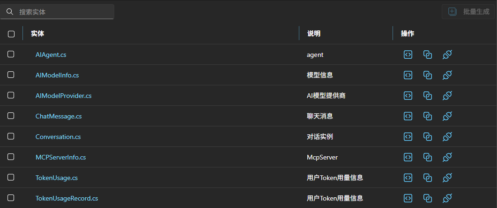
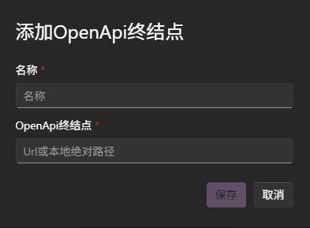
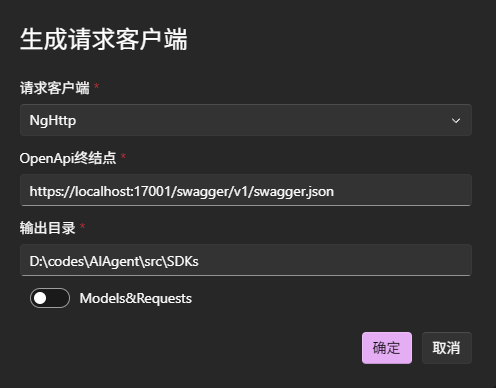

# 使用代码生成

接下来我们来见识一下代码生成的威力。本篇文档介绍如何使用代码生成功能，这里我们将通过使用`Studio WebUI`来完成相关的操作。

## 检查项目配置

通过模板创建的项目通常不需要额外的配置。保险起见，我们还是检查一下项目配置，并了解一下配置的含义。

使用`perigon studio` 启动`Studio WebUI`，点击某个解决方案旁边的⚙️图标，打开配置弹窗：

以上主要是目录的配置，这意味着你不一定要使用原模板中的目录结构，你可以自定义目录结构，但要确保与配置中保持一致即可。

这里我们主要关注的是**用户外键名**，模板默认包含了`UserId`，用来表示用户实体在其他实体中的外键属性名。

> [!NOTE]
> **用户外键名**指与身份验证相关的实体类，通常与数据权限有关，其标识使用`IUserContext`获取，在代码生成时会进行逻辑处理，所以需要与普通实体类区分出来。

## 生成DTO/Managers/Controllers

选择某个解决方案，进入工作台，我们将会看到实体列表，在操作列中有三个生成操作按钮，它们分别是:

- 生成DTO：通过实体解析生成对应的DTO模型定义
- 生成Manager：生成包含基础CURD操作的Manager类，由于依赖DTO，会自动生成成DTO。
- 生成Controller：生成包含基础CURD操作的Controller类，由于依赖Manager，会自动生成成Manager和DTO。

## 生成客户端请求服务

通过OpenAPI规范，我们可以生成对应的客户端请求服务代码。

首先，我们先来添加OpenAPI地址，点击左侧导航栏中的`OpenAPI`，进入OpenAPI管理页面，点击➕图标。

添加后，工具会请求并解析json内容(请确保地址正确并可访问)，然后提供接口列表和信息。

现在，我们来生成客户端请求服务代码，在顶部操作栏的右侧，点击`</>`图标：

- 请求客户端：目前支持生成`Angular`，`Csharp`,`Axios`客户端请求服务。
- 输出目录：代码生成的输出目录。
- OnlyModels选项：默认不选中，表示生成完整的客户端请求服务代码，如果选中则只生成模型定义。

> [!NOTE]
> 如果你觉得生成的客户端请求代码不符合你的要求，可以通过自定义模板来实现，具体请参考[自定义代码生成模板](../代码生成/自定义生成任务.md)文档。
> 
