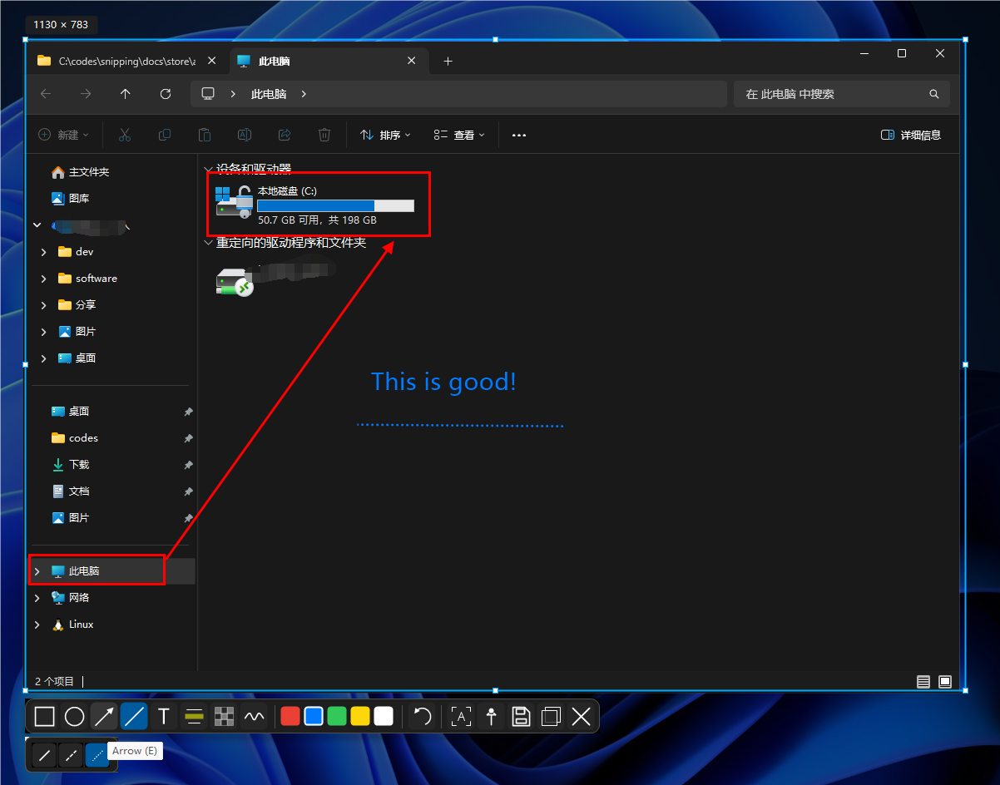

# Annotation tools

After you confirm a capture region, the toolbar appears near the selection. Annotations are composited into the screenshot when you save or copy it.

## Available tools

| Tool | Use it to |
| --- | --- |
| Rectangle, ellipse | Mark an area or highlight a detail |
| Arrow, line | Point to a target or separate content |
| Text | Add explanations, steps, or labels |
| Highlight | Emphasize content in the original image |
| Mosaic | Hide sensitive information |
| Freehand pen | Draw quickly or circle a detail |

## Common styles

- Rectangles and ellipses support opacity and border/fill modes.
- Arrows can use one or two arrowheads.
- Lines can be solid or dashed.
- Text supports font size, bold, and italic styles.
- The mosaic brush size can be adjusted.
- Available colors include red, blue, green, yellow, and white.

These options apply to the current capture session and do not change the defaults for later screenshots. Toolbar tooltips describe the available modes and shortcuts.

## Editing tips

Finish the selection before adding annotations. Save or copy the result before starting over; canceling the capture session discards content that has not been exported. Use Undo to remove the most recent annotation.

Next: [OCR, saving, and pinning](OCR-Export.md).
