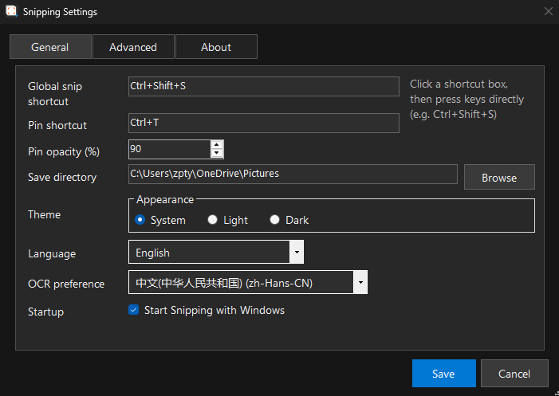

# Settings and privacy

Settings is organized into General, Appearance, Advanced, and About pages.

## General settings

| Setting | Description |
| --- | --- |
| Global screenshot shortcut | Starts a capture; defaults to `Ctrl+Shift+S` |
| Pin shortcut | Creates or controls an image pin; defaults to `Ctrl+T` |
| Save directory | Default destination for PNG/JPEG files |
| Save format | PNG or JPEG |
| JPEG quality | Controls JPEG size and quality |
| Startup | Starts EasySnipping with Windows |

## Appearance and OCR

- Choose System, Light, or Dark theme.
- Switch the interface between Chinese and English.
- Choose an OCR preference language or leave it on automatic selection.
- If Windows AI OCR is available on the device, the Advanced page shows the available OCR backend options.

Select Save to apply changes. Preferences are stored locally in `%LocalAppData%\Snipping\settings.ini`; no account is required.

## Privacy

- The app captures screen content only when you actively start a capture.
- Screenshots, annotations, and OCR text are processed in local memory by default.
- The app does not proactively upload, sell, or share screenshots, OCR text, annotations, or settings with the provider, and it does not use advertising trackers.
- Save, copy, and pin write data to a local file, the Windows clipboard, or a pin window only as a result of your action.
- OCR availability depends on Windows and installed language packs; system components may be covered by Microsoft's terms and privacy policy.

Read the full [EasySnipping Privacy Policy](https://dusi.dev/products/easysnipping/privacy-policy.html). If you use another app's sync, backup, or clipboard-management features, review that service's privacy policy as well.
