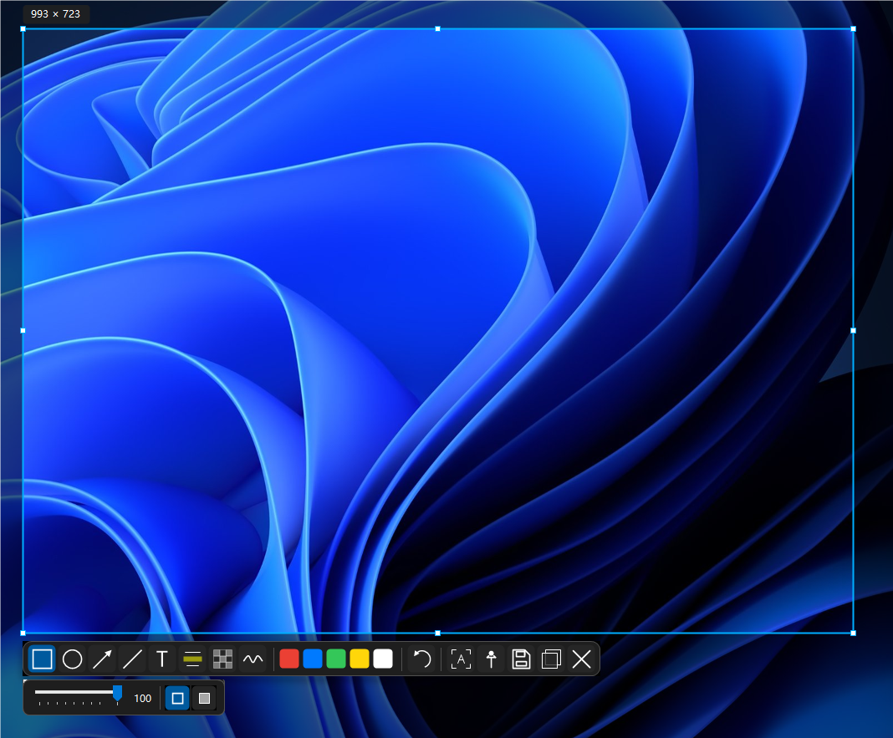

# 截图与智能选区

EasySnipping 会在截图覆盖层中优先帮助你找到窗口或控件边界；如果自动识别不适合当前场景，仍然可以直接拖拽选区。

## 自动识别窗口和控件

1. 使用 `Ctrl+Shift+S` 开始截图。
2. 将指针移动到窗口或控件上，等待候选边框出现。
3. 单击候选区域确认截图。

智能选区会综合窗口、子控件和可访问性信息。某些提升权限、自绘或特殊渲染的窗口可能无法提供精确控件边界，此时应用会回退到窗口区域或保留自由拖拽能力。

## 自由选区

在覆盖层中按住鼠标左键拖拽即可创建自由选区。自由选区适合：

- 只截取窗口中的一部分；
- 选取多个控件之间的区域；
- 自动识别未找到合适候选的场景。

应用支持多显示器和虚拟屏幕坐标。确认选区后，可以拖动选区移动位置，或使用边界手柄调整大小。

## 取消和重新选择

- 按 `Esc` 或鼠标右键取消当前截图。
- 在已确认的选区外单击，可以返回重新选择。
- 如果工具栏靠近屏幕边缘，它会自动调整到选区上方或内部可用位置。

下一步：[标注工具](标注工具.md)。
